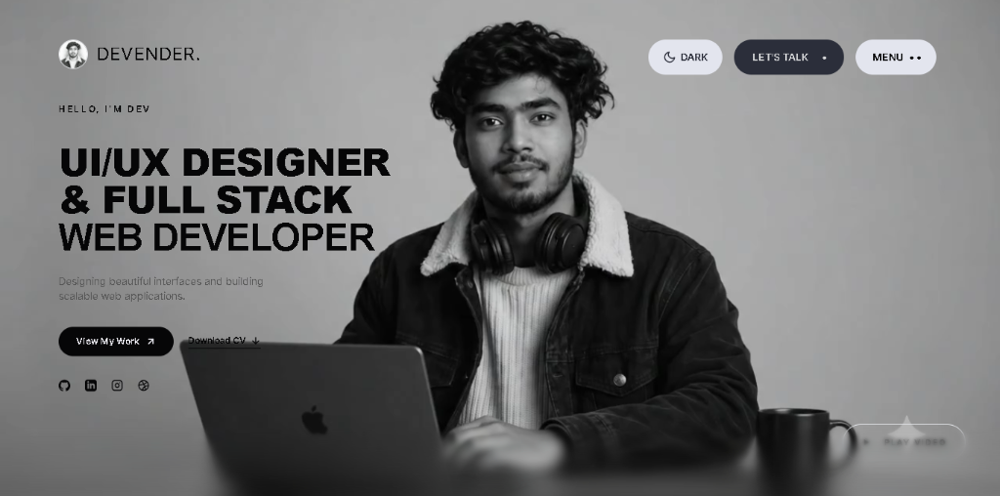
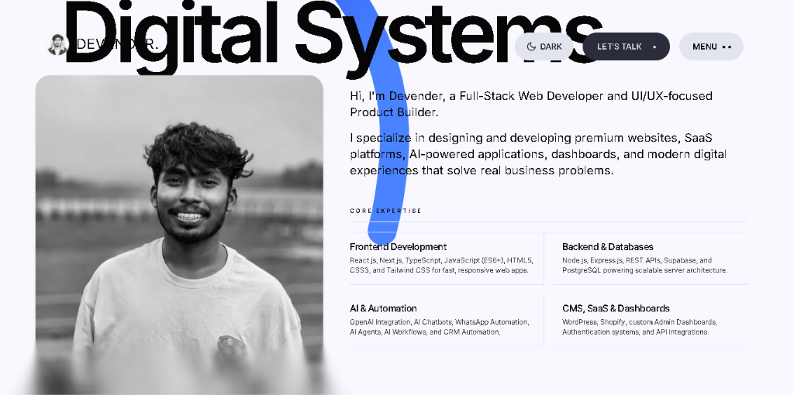
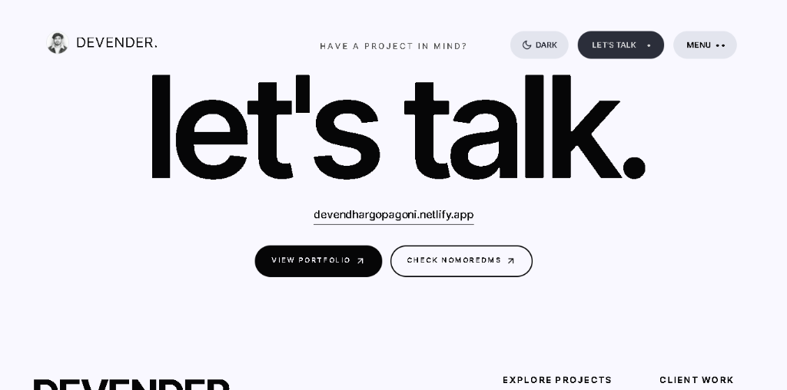

# Devender Gopagoni | Portfolio Website

A premium, interactive developer portfolio website built using Next.js, Tailwind CSS, GSAP, and Framer Motion. Featuring physics-based smooth scrolling, responsive card structures, and a multi-language interactive logo loader.

## 🌐 Live Website

Explore the live site: https://devender-video-portfolio.vercel.app/

---

## 📸 Screenshots

### 1. Hero Section
Features a high-definition background video with programmatic play/pause control, audio toggling, and an interactive 3-second centered logo loader cycling across Telugu, Hindi, and English.


### 2. About Me Section (Digital Systems)
Highlights core expertise using a clean responsive grid system alongside a high-resolution portrait sketch.


### 3. Contact & Footer Section
Provides smooth-scroll action anchors to project sections and redirects users to active platforms.


---

## ✨ Features

- **Multi-Language Logo Loader**: A custom loading screen centering the sketch logo and cycling the text "DEVENDER PORTFOLIO" in Telugu (`దేవేందర్ పోర్ట్‌ఫోలియో`), Hindi (`देवेन्द्र पोर्टफोलियो`), and English (`DEVENDER PORTFOLIO`) with smooth Framer Motion fades.
- **Background Video Hero**: High-definition video with floating play/pause controls, vertically centered left copy block, and customized diagonal/vertical action icons.
- **Responsive Layout Architecture**: Re-engineered overlaps to display clean grid layouts on mobile and desktop viewports.
- **Lenis Smooth Scroll on Mobile**: Fully enabled smooth physics inertia scrolling on touch devices (`syncTouch` and `smoothTouch`).
- **Mobile Performance Optimizations**: Auto-scaling sphere particle vertex density on mobile screens (reducing overhead from 4,096 to 1,024 points) to keep scrolling frame rates high.
- **Uncropped Selected Projects**: Clear list row layouts featuring contain-fit screenshot thumbnails with dynamic hover offsets.

---

## 🛠️ Tech Stack

- **Framework**: Next.js 14
- **Styling**: Tailwind CSS
- **Animations**: GSAP, Framer Motion, React Spring
- **3D Renderers**: React Three Fiber, React Three Drei, Three.js
- **Scroll Engine**: Lenis (Smooth Scroll)

---

## 📦 Local Installation

1. Clone the repository:
   ```bash
   git clone <repository-url>
   cd portfolio_day7
   ```

2. Install dependencies:
   ```bash
   npm install
   ```

3. Run the development server:
   ```bash
   npm run dev
   ```

4. Open [http://localhost:3000](http://localhost:3000) in your browser.

---

## 🚀 Build for Production

To compile and verify page routes for static delivery:
```bash
npm run build
npm start
```
